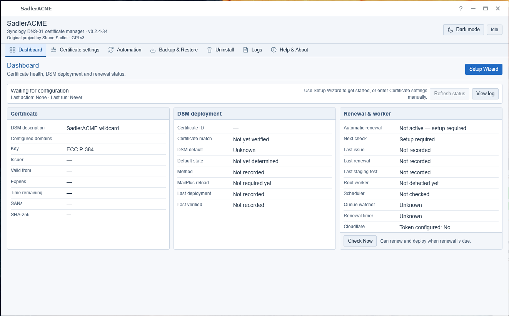
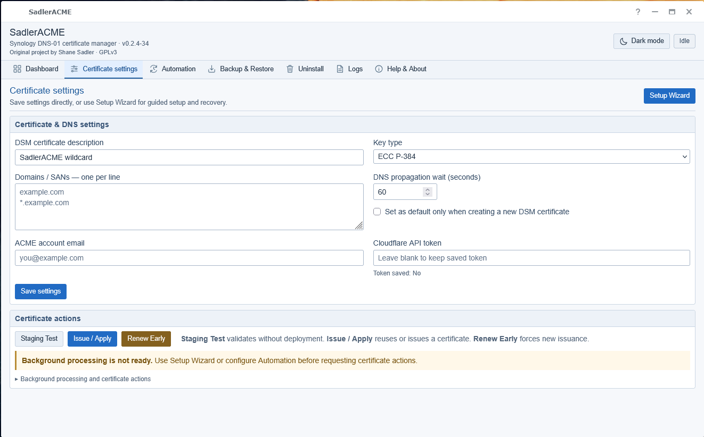

# SadlerACME

**Let's Encrypt wildcard and multi-domain certificates for Synology DSM using Cloudflare DNS.**

**Original project by Shane Sadler.**

SadlerACME is a Synology DSM package for users who manage their DNS through **Cloudflare** and want more certificate flexibility than the standard DSM certificate workflow provides. It uses Cloudflare DNS-01 validation to issue and renew Let's Encrypt certificates, then deploys the resulting certificate into DSM.

## Why SadlerACME?

SadlerACME is particularly useful when you want to:

- issue **wildcard certificates**, such as `*.example.com`;
- place **multiple domain names / SANs** on one certificate;
- use **Cloudflare DNS-01 validation**, so ACME validation does not depend on exposing a web server on port 80;
- automatically renew the certificate and deploy the renewed certificate back into DSM; and
- manage the process from a DSM application instead of maintaining ACME shell scripts manually.

> **Cloudflare DNS is required.** SadlerACME is deliberately focused on Cloudflare rather than attempting to support every DNS provider.

### How SadlerACME fits into DSM

SadlerACME provides a Cloudflare DNS-01 workflow inside DSM for wildcard and multi-domain certificates. It keeps certificate validation, automatic renewal and deployment together in a guided application. The finished certificate is installed into DSM, where it can be assigned to DSM itself and supported services such as reverse proxies, web applications and mail services.

The key distinction is the **Cloudflare DNS-01 workflow**, not a claim that every certificate capability listed above is exclusive to SadlerACME.

## Interface preview

These screenshots show a new installation before setup. They retain the version displayed when captured; the illustrated interface is unchanged for this release.





## Public beta

SadlerACME is currently released as a **public beta**. It has undergone extensive development and lab testing, including certificate issuance and deployment, scheduled renewal, recovery and removal workflows, and native DSM interface testing.

It has not yet been tested on every supported Synology model or DSM 7 point release. Beta users should maintain normal NAS backups and retain an alternative way to access DSM while evaluating the package.

If you encounter a problem, report the **Synology model, DSM version, SadlerACME version, what you were doing, and the relevant SadlerACME log output**. Do not include Cloudflare API tokens, DSM passwords, private keys, recovery backups or other credentials in reports.

## Supported platforms

SadlerACME is currently provided for **Synology NAS systems running DSM 7.0 or later on x86_64 (Intel/AMD) processors**.

The current package is not built for ARM-based Synology models. Testing has been performed on x86_64 DSM 7 systems. Other compatible x86_64 Synology models are welcome in the beta, but may not yet have been individually verified.

XPEnology/Arc environments are useful development and test environments but are not presented as officially supported Synology platforms.

## Start here

- [QuickStart](QUICKSTART.md) — installation and guided setup.
- [Workflow](WORKFLOW.md) — wizard, direct settings, certificate actions and automation.
- [Recovery and removal](RECOVERY.md) — backup, restore, normal uninstall and administrator SSH recovery.
- [Changelog](CHANGELOG.md) — version-specific changes.
- [Release notes](RELEASE-NOTES.md) — first public-beta release.
- [Illustrated installation and interface guide](docs/Installation-and-Interface-Guide.docx) — step-by-step screenshots.
- [Release guide](RELEASE-GUIDE.md) — release and packaging information.
- [Tester checklist](TESTER-CHECKLIST.md) — structured beta testing guidance.

The package also includes browser-readable QuickStart, Workflow and Recovery help, plus a downloadable standalone SSH recovery helper.

## Quick overview

1. Install the SadlerACME `.spk` through **Package Center → Manual Install**.
2. Open SadlerACME from an administrator's DSM desktop over HTTPS.
3. Start **Setup Wizard** from Dashboard or Certificate settings.
4. Enter your certificate settings, domains and Cloudflare API token.
5. Start or verify the protected worker when prompted and confirm DSM administrator approval.
6. Run a **staging test** before production issuance.
7. Choose **Apply & Save** when ready to issue/deploy the production certificate.
8. Complete the final automation step so renewal checks can continue unattended.
9. Verify the certificate DSM is serving and download a recovery backup.

See [QuickStart](QUICKSTART.md) for the complete guided procedure.

## Cloudflare requirements

SadlerACME uses the Cloudflare API for DNS-01 validation. The API token needs access to the DNS zones used by the certificate, including:

- **Zone / DNS / Edit**
- **Zone / Zone / Read**

Use the narrowest Cloudflare token scope that covers the required zones.

A certificate can contain an ordinary domain, wildcard domain, or multiple SANs, for example:

```text
example.com
*.example.com
mail.example.net
```

Each DNS name must be covered by a Cloudflare zone accessible to the supplied token.

## What it does

- Uses a bundled, pinned acme.sh engine with Cloudflare DNS-01 validation.
- Supports ordinary, wildcard and multi-domain/SAN certificates.
- Separates staging validation, production issuance, renewal checks and DSM deployment.
- Reuses a managed DSM certificate identity and preserves its DSM assignments during replacement where supported by the workflow.
- Uses a protected root worker rather than running privileged certificate operations directly in the browser UI.
- Provides managed DSM automation for unattended renewal checks.
- Provides a guided Setup Wizard while retaining direct Certificate settings and manual certificate actions for experienced users.
- Provides Dashboard, Certificate settings, Automation, Backup & Restore, Uninstall, Logs, and Help & About sections.
- Supports dark and light application themes.
- Provides recovery backup, restore, uninstall preparation and administrator recovery guidance.

## Setup Wizard and direct operation

The **Setup Wizard is optional** and does not start automatically after installation or upgrade. It is intended to guide a new setup or recovery without hiding the normal application controls.

The wizard keeps changed certificate settings as a draft until you explicitly choose **Apply & Save**. A staging test validates the draft without replacing the production certificate in DSM.

Outside the wizard:

- **Save Settings** saves configuration without issuing a certificate.
- **Issue / Apply** performs production issuance and DSM deployment when required.
- **Check Now** can perform a normal renewal check and may renew/deploy when the certificate is due.
- **Renew Early** deliberately forces an early renewal and is not intended as a normal setup step.

Changing domains or key type in Certificate settings does not silently replace the certificate DSM is currently serving. SadlerACME reports when **Issue / Apply** is required.

## Automatic renewal

SadlerACME can install managed DSM automation for periodic renewal checks. The renewal process checks the current certificate state and only performs issuance/deployment when needed, unless an explicit early-renewal action is requested.

The Dashboard and Automation sections show the current automation state, recent activity and renewal information. A displayed next-check time is status information rather than a guarantee that the browser has refreshed since the underlying state changed, so refresh the application when verifying recent operations.

## Backup and recovery

SadlerACME can create a downloadable recovery backup containing selected settings, certificate files and ACME recovery data.

**Recovery backups are sensitive because they contain private key material.** Store them securely.

Cloudflare API tokens and DSM passwords are not included in the recovery backup. They must be supplied again when required.

Restoring a SadlerACME recovery backup restores application/certificate recovery data but does **not** automatically issue a new certificate or replace the certificate currently installed in DSM. The wizard guides you through verification and re-deployment when appropriate.

See [Recovery and removal](RECOVERY.md) before relying on backup/restore for disaster recovery.

## Uninstall behaviour

SadlerACME includes a preparation workflow before Package Center removal. Preparation stops relevant background helpers, removes recognised DSM Task Scheduler entries, handles pending work and records readiness for uninstall.

Removing SadlerACME does **not** revoke or automatically remove the certificate already installed in DSM. Services can continue using that certificate, but SadlerACME will no longer renew it. Arrange a replacement or reinstall/restore SadlerACME before the certificate expires.

If normal removal cannot complete, the application includes administrator SSH recovery guidance and a standalone helper. See [Recovery and removal](RECOVERY.md).

## Security model

SadlerACME deliberately separates the DSM web interface from privileged certificate operations.

- The browser UI does not directly perform root certificate operations.
- Privileged work is handled by a protected worker and controlled request/receipt paths.
- DSM administrator approval is requested when privileged setup actions require it.
- Cloudflare tokens, DSM passwords, private keys and recovery backups should never be included in bug reports.
- Recovery backups contain private keys and must be treated as secrets.
- The Cloudflare token should be restricted to only the zones and permissions required for DNS-01 validation.

The package is intended to be administered through DSM over HTTPS.

## Certificate deployment notes

Before first production deployment, keep an independent protected copy of important existing certificate material and record critical DSM service assignments.

After deployment, verify the certificate actually served by each relevant service rather than relying only on the certificate entry shown in DSM. This is especially important for reverse proxies, web applications and mail services.

Staging certificates are for validation only and are not intended to replace the production certificate in DSM.

## Interface notes

SadlerACME uses horizontal top navigation on normal desktop sizes and a compact menu when space is limited. The application supports dark and light modes; the theme preference belongs to the browser and does not alter certificate settings.

The main application window uses DSM's window system. A fresh opening is centred when there is no saved geometry, and DSM can retain the user's later window size and position. Very small or highly zoomed browser views can eventually reach the application's practical minimum usable viewport.

Logs use their own scrolling areas where space permits so navigation and action controls remain accessible.

## Upgrading

Install a newer SadlerACME package through **Package Center → Manual Install** over the existing installation unless the release notes explicitly say otherwise.

Do not uninstall merely to perform a normal upgrade. Uninstalling can remove application data and can turn a routine upgrade into a recovery/reconfiguration exercise.

After an upgrade, refresh the DSM desktop and reopen SadlerACME. Review the version-specific [Changelog](CHANGELOG.md) or supplied release notes for any special migration or validation steps.

## Build and tests

Build on Linux using Python 3 and GNU tar:

```sh
sh build-spk.sh
```

The generated package is written under `dist/` using the current project version in its filename.

The source tree includes offline regression, workflow, scheduler, recovery, lifecycle and UI tests. Depending on the suite, additional tools such as Node.js, jq, OpenSSL, cryptography, flock and a browser automation environment may be required.

Typical checks include:

```sh
python3 tests/regression.py
python3 tests/scheduled-renewal.py
python3 tests/recovery.py
python3 tests/lifecycle.py
python3 tests/scheduler-bridge.py
node tests/workflow-ui.js
node tests/temporary-worker-ui.js
```

Offline tests use temporary filesystems and mocked DSM/ACME boundaries unless a test explicitly states otherwise. They do not replace native NAS testing. Version-specific validation results belong in the release/test records rather than this README.

## Reporting a beta issue

Include:

- Synology model;
- DSM version;
- SadlerACME version;
- whether the installation was new, upgraded or restored;
- the action you were attempting;
- the exact message displayed; and
- relevant SadlerACME log lines.

Remove or redact all credentials and secret material before sharing logs or screenshots.

## Licence and credit

**Original project by Shane Sadler.** SadlerACME's original files are licensed under **GNU GPL version 3 only (`GPL-3.0-only`)**. See [LICENSE](LICENSE) and [NOTICE.txt](NOTICE.txt).

Bundled upstream components retain their own authorship and licences; see [vendor/NOTICE.md](vendor/NOTICE.md).

SadlerACME is not endorsed by Synology, Cloudflare or the acme.sh project.
